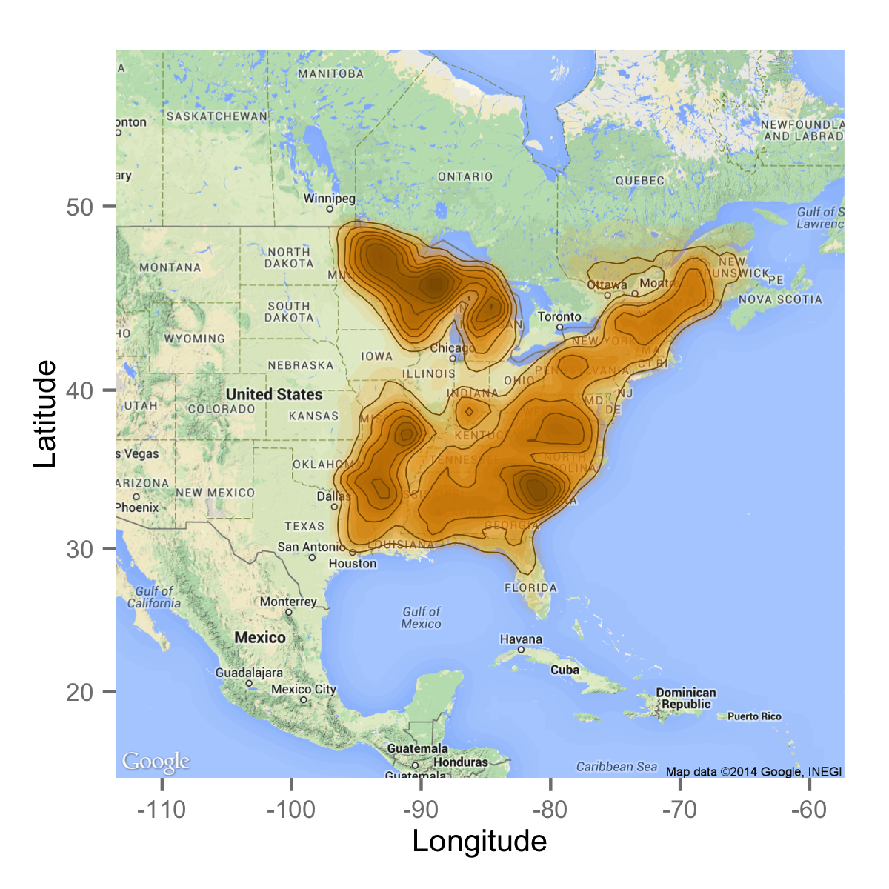

STModel-Data
============

## Getting started

#### 1. Download repository

	git clone git@github.com:TheoreticalEcosystemEcology/STModel-Data.git
	cd STModel-Data
	
#### 2. Install R dependencies

	install.packages("RPostgreSQL")
	install.packages("ggmap")

#### 3. Setup your database account

In ```con_quicc_db.r```, replace ```dbuser``` and ```dbpass``` variables with your account. Your computer must be connected by wired on the UQAR network.

#### 4. Get all datasets

	make all

## Retrieve dataset separately

**Get only tree data**: ```make get_treeData```

**Get only climatic data**: ```make get_climData```

**Get only plot info data**: ```make get_plotInfoData```

**Get only past climate grid input**: ```make get_pastClimate_grid```

## Plots distribution



## Datasets metadata

### plotInfoData

Column        | Description
---           | ---
**plot_id**   | Unique id of the plot
**longitude** | longitude of the plot (degree decimal)
**latitude**  | latitude of the plot (degree decimal)
**srid**      | Spatial Reference System Identifier. All plots have a srid code corresponding to the datum: WGS84 (see [here](http://spatialreference.org/ref/epsg/4326/)).
**drainage**  | *coming soon* 
**slope**     | *coming soon* (in degree)

### treeData

Column        | Description
---           | ---
**plot_id**   | Unique id of the plot
**year** | year of the measurement
**latitude**  | latitude of the plot (degree decimal)
**srid**      | Spatial Reference System Identifier. All plots have a srid code corresponding to the datum: WGS84 (see [here](http://spatialreference.org/ref/epsg/4326/)).
**drainage**  | *coming soon* 
**slope**     | *coming soon* (in degree)

### climData 

Column                                      | Description
---                                         | ---
**plot_id**                                 | Unique id of the plot
**year_measured**                           | year of the measurement
**mean_diurnal_range**                      | Avg of monthly temperature ranges
**isothermality**                           | mean_diurnal_range ÷ temp_annual_range
**temp_seasonality**                        | Standard deviation of monthly-mean temperature estimates expressed as a percent of their mean
**max_temp_warmest_period**                 | Highest monthly maximum temperature
**min_temp_coldest_period**                 | Lowest monthly minimum temperature
**temp_annual_range**                       | max_temp_warmest_period – min_temp_coldest_period
**mean_temperatre_wettest_quarter**         | Avg temperature during 3 wettest months
**mean_temp_driest_quarter**                | Avg temperature during 3 driest months
**mean_temp_warmest_quarter**               | Avg temperature during 3 warmest months
**mean_temp_coldest_quarter**               | Avg temperature during 3 coldest months
**annual_pp**                               | Sum of monthly precipitation values
**pp_wettest_period**                       | Precipitation of the wettest month
**pp_driest_period**                        | Precipitation of the driest month
**pp_seasonality**                          | Standard deviation of the monthly precipitation estimates expressed as a percent of their mean
**pp_wettest_quarter**                      | Total precipitation of 3 wettest months
**pp_driest_quarter**                       | Total precipitation of 3 driest months
**pp_warmest_quarter**                      | Total precipitation of 3 warmest months
**pp_coldest_quarter**                      | Total precipitation of 3 coldest months
**julian_day_number_start_growing_season**  | Julian day number at start of growing season
**julian_day_number_at_end_growing_season** | Julian day number at end of growing season
**number_days_growing_season**              | Length of growing season (days)
**total_pp_for_period_1**                   | Total precipitation 3 weeks prior to growing season
**total_pp_for_period_3**                   | Total precipitation during the growing season
**gdd_above_base_temp_for_period_3**        | Degree days (above 5ºC) for growing season Variable
**annual_mean_temp**                        | Avg of mean monthly temperatures
**annual_min_temp**                         | Avg of min monthly temperatures
**annual_max_temp**                         | Avg of max monthly temperatures
**mean_temp_for_period_3**                  | Average temperature during growing season
**temp_range_for_period_3**                 | Highest maximum temperature minus lowest minimum temperature during growing

### pastClimate_grid

Column   | Description
---      | ---
**x**    | x coordinate of the cell (longitude). i.e. x = 0 corresponds to min(longitude)
**y**    | y coordinate of the cell (latitude). i.e. y = 0 corresponds to min(latitude)
**year** | year of the climate measurement. In the sql query, year column equal to 0 because the climate has been aggregated temporarily.
**env1** | average of the mean temperature (°C) between 1970-2000.
**env2** | average of the annual precipitation (meters) between 1970-2000.

## Code metadata

### Species

Code           | Species
---            | ---
18032-ABI-BAL  | Balsam fir
18034-PIC-RUB  | Red spruce
19408-QUE-RUB  | Red oak
19462-FAG-GRA  | American beech
19466-ALN-NA   | Saule
19481-BET-ALL  | Yellow birch
19489-BET-PAP  | White
19511-OST-VIR  | Ironwood
21536-TIL-AME  | Basswood
22453-POP-BAL  | Balsam poplar
22463-POP-GRA  | Large tooth
24764-PRU-SER  | Black cherry
24799-PRU-PEN  | Pin cherry
25319-SOR-AME  | American mountain-ash
28728-ACE-RUB  | Red maple
28731-ACE-SAC  | Sugar maple
32931-FRA-AME  | White ash
32945-FRA-NIG  | Black ash
183295-PIC-GLA | White spruce
183302-PIC-MAR | Black spruce
183319-PIN-BAN | jack pine
183412-LAR-LAR | Tamarack
195773-POP-TRE | Trembling aspen

### Drainage 

*coming soon*