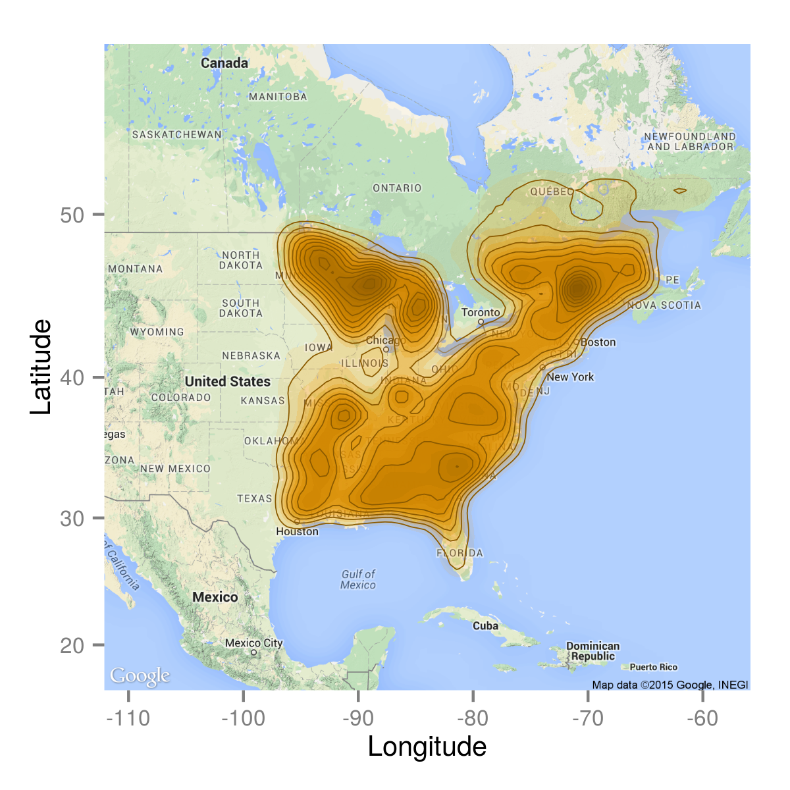

STModel-Data
============

## Getting started

	git clone git@github.com:TheoreticalEcosystemEcology/STModel-Data.git
	cd STModel-Data
	make all

## Dependencies

	install.packages("RPostgreSQL")
	install.packages("ggmap")

## Retrieve STM data from the QUICC-FOR database

**Get only tree data**: ```make get_treeData```

**Get only climatic data**: ```make get_climData```

**Get only plot info data**: ```make get_plotInfoData```

**Get only past climate grid input**: ```make get_pastClimate_grid```

## Plots distribution



## Metadata

#### pastClimate_grid:

- **x** : x coordinate of the cell (longitude). i.e. x = 0 corresponds to min(longitude)
- **y** : y coordinate of the cell (latitude). i.e. y = 0 corresponds to min(latitude)
- **year**: year of the climate measurement. In the sql query, year column equal to 0 because the climate has been aggregated temporarily.
- **env1**: average of the mean temperature (°C) between 1970-2000.
- **env2**: average of the annual precipitation (meters) between 1970-2000.

#### treeData:

- **plot_id** : Unique id of the plot
- **year_measured** : year of the measurement
- **id_spe**: Species code, details are available in ./out_files/stm_code_species.csv file
- **basal area**: basal area of the species in **m²/ha**